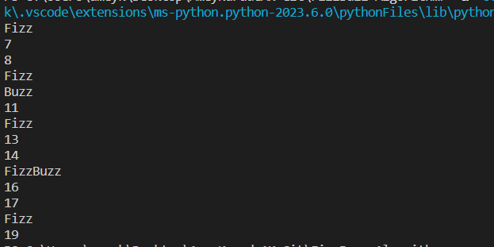

# FizzBuzz Algorithm
The FizzBuzz algorithm comes from a children’s game. This algorithm has been one of the favourite coding interview questions for a very long time. In this problem, you are given a range of integers and you need to produce output according to the rules mentioned below:

1. If the integer (x) is divisible by 3, the output must be replaced by “Fizz”.
2. If the integer (x) is divisible by 5, the output must be replaced by “Buzz”.
3. If the integer (x) is divisible by 3 and 5, the output should be replaced by “FizzBuzz”.

This coding problem is popular among numbers 3 and 5, but you may be able to see more complex numbers, but the logic for solving the problem will remain the same.

# Demo

# Summary
Fizz and Buzz refer to numbers that are divisible by 3 and 5. If a number is divisible by 3, it is replaced by “Fizz”, if the number is divisible by 5, it is replaced by “Buzz”, and if the number is divisible by 3 and 5 then the number is replaced by “FizzBuzz”.

# Contribution
You can contribute this Repo by Forking repo.\
Pull request accepted.